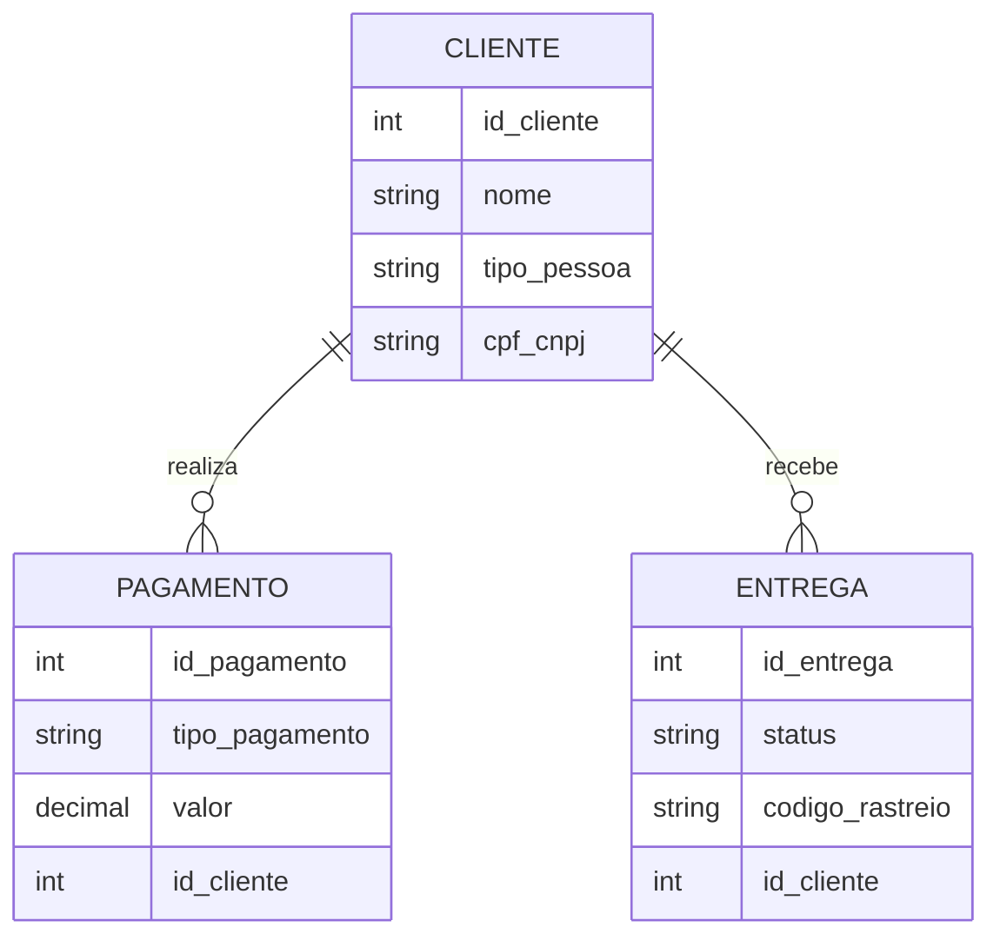

# Projeto de Modelagem de Banco de Dados E-Commerce

Este repositório contém um projeto de modelagem conceitual de banco de dados, especificamente voltado para um sistema de e-commerce. O objetivo é refinar um modelo apresentado anteriormente e incluir novas funcionalidades, como diferentes tipos de clientes (Pessoa Jurídica e Pessoa Física), múltiplas formas de pagamento, e controle de status de entregas.

## Objetivo

Refinar o modelo apresentado adicionando os seguintes pontos:

- **Cliente PJ e PF:** Uma conta pode ser do tipo PJ (Pessoa Jurídica) ou PF (Pessoa Física), mas não pode ser as duas simultaneamente.
- **Pagamento:** O sistema permite o cadastro de mais de uma forma de pagamento por cliente.
- **Entrega:** Cada entrega possui um status e código de rastreamento.

## Modelo Entidade-Relacionamento (ER)

Utilizamos o Mermaid para desenhar o modelo conceitual de banco de dados no formato ER. O diagrama visualiza as principais entidades e seus relacionamentos dentro do sistema de e-commerce.

### Diagrama ER:

## Detalhes do Modelo

### Cliente
Os clientes podem ser de dois tipos: Pessoa Jurídica (PJ) ou Pessoa Física (PF). Cada cliente possui um identificador único, um nome e um campo exclusivo para CPF ou CNPJ, dependendo do tipo de cliente.

### Pagamento
Os clientes podem utilizar várias formas de pagamento, como cartão de crédito, boleto bancário, ou transferências eletrônicas. Cada pagamento está associado a um cliente e possui um valor e tipo de pagamento.

### Entrega
O sistema de entrega registra o status de cada envio, além de fornecer um código de rastreio para que o cliente possa acompanhar a entrega dos produtos. Cada entrega está vinculada a um cliente específico.

## Como Usar

1. Clone este repositório para sua máquina local.
2. Analise o diagrama ER para entender a estrutura conceitual do banco de dados.
3. Utilize o diagrama como base para a implementação do modelo físico, criando as tabelas e relacionamentos no seu sistema de banco de dados relacional de escolha.
