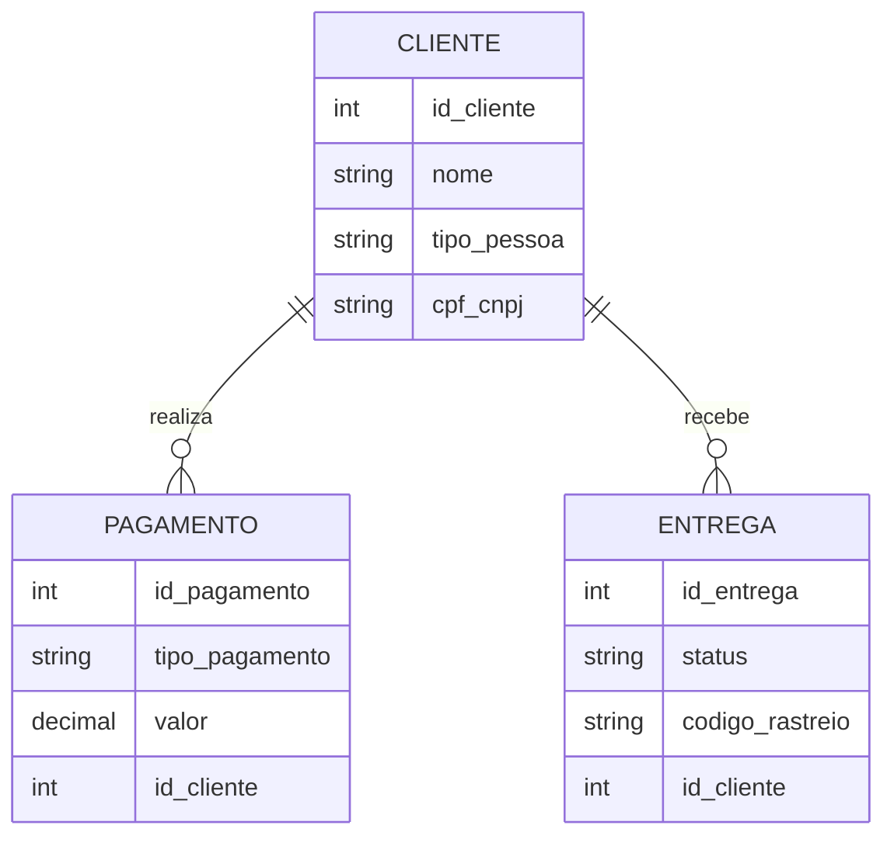
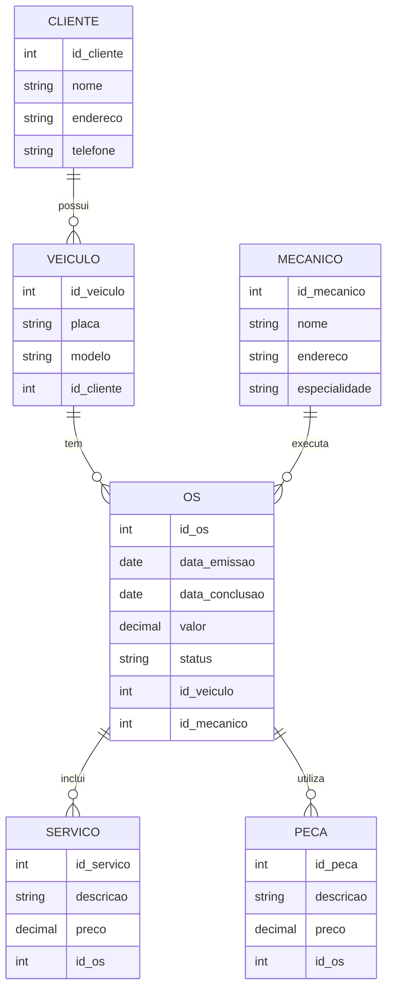

# Projeto de Modelagem de Banco de Dados E-Commerce

Este repositório contém um projeto de modelagem conceitual de banco de dados, especificamente voltado para um sistema de e-commerce. O objetivo é refinar um modelo apresentado anteriormente e incluir novas funcionalidades, como diferentes tipos de clientes (Pessoa Jurídica e Pessoa Física), múltiplas formas de pagamento, e controle de status de entregas.

## Objetivo

Refinar o modelo apresentado adicionando os seguintes pontos:

- **Cliente PJ e PF:** Uma conta pode ser do tipo PJ (Pessoa Jurídica) ou PF (Pessoa Física), mas não pode ser as duas simultaneamente.
- **Pagamento:** O sistema permite o cadastro de mais de uma forma de pagamento por cliente.
- **Entrega:** Cada entrega possui um status e código de rastreamento.

## Modelo Entidade-Relacionamento (ER)

Utilizamos o Mermaid para desenhar o modelo conceitual de banco de dados no formato ER. O diagrama visualiza as principais entidades e seus relacionamentos dentro do sistema de e-commerce.

### Diagrama ER:

## Detalhes do Modelo

### Cliente
Os clientes podem ser de dois tipos: Pessoa Jurídica (PJ) ou Pessoa Física (PF). Cada cliente possui um identificador único, um nome e um campo exclusivo para CPF ou CNPJ, dependendo do tipo de cliente.

### Pagamento
Os clientes podem utilizar várias formas de pagamento, como cartão de crédito, boleto bancário, ou transferências eletrônicas. Cada pagamento está associado a um cliente e possui um valor e tipo de pagamento.

### Entrega
O sistema de entrega registra o status de cada envio, além de fornecer um código de rastreio para que o cliente possa acompanhar a entrega dos produtos. Cada entrega está vinculada a um cliente específico.

# Projeto de Modelagem de Banco de Dados - Oficina Mecânica

Este repositório contém o projeto de modelagem de banco de dados para um sistema de controle e gerenciamento de ordens de serviço (OS) em uma oficina mecânica. A modelagem foi feita com base em requisitos funcionais, detalhando o processo de execução de serviços em veículos, desde a entrada na oficina até a conclusão dos reparos.

## Objetivo

O objetivo do projeto é criar uma estrutura de banco de dados para gerenciar:

- **Ordens de serviço (OS):** Cada ordem contém informações sobre os serviços a serem executados, peças utilizadas, e o responsável pela execução.
- **Clientes:** Informações sobre os veículos e seus proprietários.
- **Mecânicos:** Equipes de mecânicos responsáveis por realizar os serviços.
- **Peças:** Registro das peças utilizadas nos serviços.

## Requisitos

A modelagem foi elaborada seguindo os seguintes requisitos:

- **Clientes levam veículos à oficina para conserto ou revisão.**
- **Cada veículo é designado a uma equipe de mecânicos, que define os serviços a serem executados.**
- **Os serviços e peças são registrados em uma OS, juntamente com a data de entrega prevista.**
- **Cada OS possui número, data de emissão, valor, status e data de conclusão.**
- **Uma OS pode conter vários serviços e uma mesma peça pode ser usada em mais de uma OS.**
- **Os mecânicos possuem código, nome, endereço e especialidade.**
- **Os serviços são calculados com base em uma tabela de referência de mão de obra, e o valor das peças também é adicionado à OS.**
- **O cliente autoriza a execução dos serviços antes que a equipe comece o trabalho.**

## Modelo Entidade-Relacionamento (ER)

A seguir, o diagrama ER do projeto, modelado em Mermaid:

### Diagrama ER:

## Detalhes do Modelo

### Cliente
Os clientes são proprietários dos veículos que trazem à oficina. Cada cliente possui um identificador único, além de informações de contato.

### Veículo
Cada veículo está associado a um cliente. As informações sobre o veículo incluem a placa e o modelo.

### Mecânico
Os mecânicos realizam os serviços na oficina. Cada mecânico possui um código identificador, nome, endereço e especialidade (ex: motor, pintura, etc.).

### Ordem de Serviço (OS)
A OS é o centro do sistema, registrando os serviços prestados, as peças utilizadas, e os mecânicos envolvidos. Cada OS possui data de emissão, data de conclusão, valor total e status (ex: em andamento, concluída).

### Serviço
Os serviços executados na OS são registrados com descrição e preço. Uma OS pode incluir vários serviços.

### Peça
As peças utilizadas durante os serviços também são registradas na OS, com descrição e valor.

## Como Usar

1. Clone este repositório para sua máquina local.
2. Analise o diagrama ER para entender a estrutura conceitual do banco de dados.
3. Utilize o diagrama como base para a implementação do modelo físico no banco de dados relacional de sua escolha.
