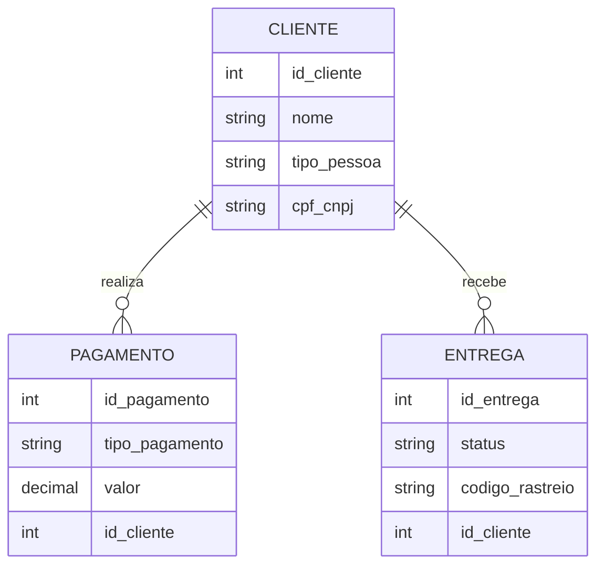
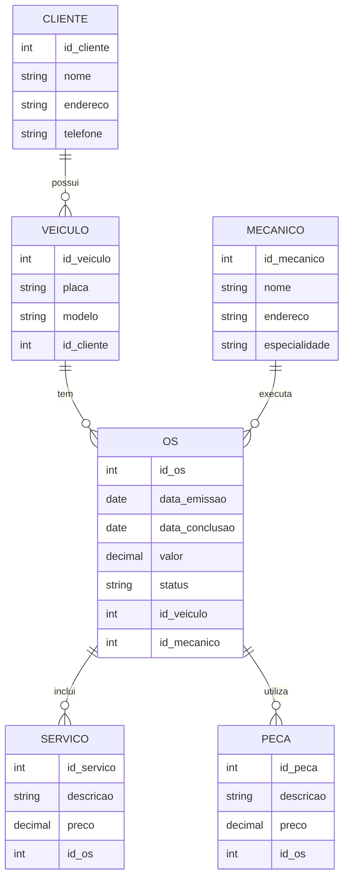
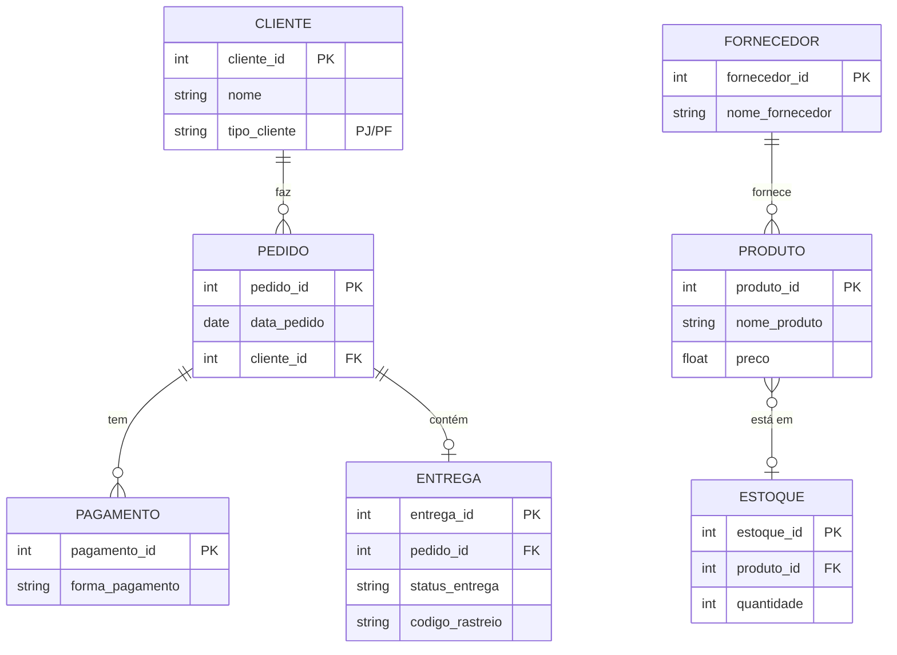

# Projeto de Modelagem de Banco de Dados E-Commerce

Este repositório contém um projeto de modelagem conceitual de banco de dados, especificamente voltado para um sistema de e-commerce. O objetivo é refinar um modelo apresentado anteriormente e incluir novas funcionalidades, como diferentes tipos de clientes (Pessoa Jurídica e Pessoa Física), múltiplas formas de pagamento, e controle de status de entregas.

## Objetivo

Refinar o modelo apresentado adicionando os seguintes pontos:

- **Cliente PJ e PF:** Uma conta pode ser do tipo PJ (Pessoa Jurídica) ou PF (Pessoa Física), mas não pode ser as duas simultaneamente.
- **Pagamento:** O sistema permite o cadastro de mais de uma forma de pagamento por cliente.
- **Entrega:** Cada entrega possui um status e código de rastreamento.

## Modelo Entidade-Relacionamento (ER)

Utilizamos o Mermaid para desenhar o modelo conceitual de banco de dados no formato ER. O diagrama visualiza as principais entidades e seus relacionamentos dentro do sistema de e-commerce.

### Diagrama ER:



## Detalhes do Modelo

### Cliente
Os clientes podem ser de dois tipos: Pessoa Jurídica (PJ) ou Pessoa Física (PF). Cada cliente possui um identificador único, um nome e um campo exclusivo para CPF ou CNPJ, dependendo do tipo de cliente.

### Pagamento
Os clientes podem utilizar várias formas de pagamento, como cartão de crédito, boleto bancário, ou transferências eletrônicas. Cada pagamento está associado a um cliente e possui um valor e tipo de pagamento.

### Entrega
O sistema de entrega registra o status de cada envio, além de fornecer um código de rastreio para que o cliente possa acompanhar a entrega dos produtos. Cada entrega está vinculada a um cliente específico.

# Projeto de Modelagem de Banco de Dados - Oficina Mecânica

Este repositório contém o projeto de modelagem de banco de dados para um sistema de controle e gerenciamento de ordens de serviço (OS) em uma oficina mecânica. A modelagem foi feita com base em requisitos funcionais, detalhando o processo de execução de serviços em veículos, desde a entrada na oficina até a conclusão dos reparos.

## Objetivo

O objetivo do projeto é criar uma estrutura de banco de dados para gerenciar:

- **Ordens de serviço (OS):** Cada ordem contém informações sobre os serviços a serem executados, peças utilizadas, e o responsável pela execução.
- **Clientes:** Informações sobre os veículos e seus proprietários.
- **Mecânicos:** Equipes de mecânicos responsáveis por realizar os serviços.
- **Peças:** Registro das peças utilizadas nos serviços.

## Requisitos

A modelagem foi elaborada seguindo os seguintes requisitos:

- **Clientes levam veículos à oficina para conserto ou revisão.**
- **Cada veículo é designado a uma equipe de mecânicos, que define os serviços a serem executados.**
- **Os serviços e peças são registrados em uma OS, juntamente com a data de entrega prevista.**
- **Cada OS possui número, data de emissão, valor, status e data de conclusão.**
- **Uma OS pode conter vários serviços e uma mesma peça pode ser usada em mais de uma OS.**
- **Os mecânicos possuem código, nome, endereço e especialidade.**
- **Os serviços são calculados com base em uma tabela de referência de mão de obra, e o valor das peças também é adicionado à OS.**
- **O cliente autoriza a execução dos serviços antes que a equipe comece o trabalho.**

## Modelo Entidade-Relacionamento (ER)

A seguir, o diagrama ER do projeto, modelado em Mermaid:

### Diagrama ER:



## Detalhes do Modelo

### Cliente
Os clientes são proprietários dos veículos que trazem à oficina. Cada cliente possui um identificador único, além de informações de contato.

### Veículo
Cada veículo está associado a um cliente. As informações sobre o veículo incluem a placa e o modelo.

### Mecânico
Os mecânicos realizam os serviços na oficina. Cada mecânico possui um código identificador, nome, endereço e especialidade (ex: motor, pintura, etc.).

### Ordem de Serviço (OS)
A OS é o centro do sistema, registrando os serviços prestados, as peças utilizadas, e os mecânicos envolvidos. Cada OS possui data de emissão, data de conclusão, valor total e status (ex: em andamento, concluída).

### Serviço
Os serviços executados na OS são registrados com descrição e preço. Uma OS pode incluir vários serviços.

### Peça
As peças utilizadas durante os serviços também são registradas na OS, com descrição e valor.

# Projeto de Modelagem de Banco de Dados para E-commerce

## Descrição do Desafio

O objetivo deste projeto é replicar a modelagem de banco de dados para um cenário de e-commerce, aplicando conceitos de modelagem lógica, incluindo definições de chaves primárias e estrangeiras, bem como constraints e relacionamentos presentes no modelo EER (Enhanced Entity-Relationship). Além disso, o projeto visa criar um script SQL para a criação do esquema de banco de dados, persistência de dados para testes e elaboração de consultas SQL complexas, seguindo as diretrizes estabelecidas no desafio.

## Diretrizes

- Realizar a modelagem lógica e física do banco de dados.
- Criar um script SQL para criar o esquema do banco, incluindo tabelas, chaves primárias, estrangeiras e constraints.
- Implementar a persistência de dados para realização de testes.
- Criar consultas SQL que demonstrem a manipulação e recuperação de dados de forma eficiente, utilizando cláusulas como `SELECT`, `WHERE`, `ORDER BY`, `HAVING`, e junções entre tabelas.
- Elaborar perguntas que possam ser respondidas através das consultas criadas.

## Cenário de Modelagem

### Requisitos

1. **Cliente PJ e PF**: Uma conta pode ser Pessoa Jurídica (PJ) ou Pessoa Física (PF), mas não pode ter ambas as informações.
2. **Pagamento**: Deve permitir o cadastro de mais de uma forma de pagamento por pedido.
3. **Entrega**: Deve incluir informações sobre status de entrega e código de rastreio.

## Exemplos de Perguntas a serem Respondidas pelas Consultas

- Quantos pedidos foram feitos por cada cliente?
- Algum vendedor também é fornecedor?
- Relação de produtos, fornecedores e seus respectivos estoques.
- Relação de nomes dos fornecedores e produtos oferecidos.

## Modelo EER



## Script de Criação do Banco de Dados

<details>
<summary>Clique para visualizar o script de criação</summary>

```sql
-- Criação da tabela de CLIENTES
CREATE TABLE CLIENTE (
    cliente_id INT PRIMARY KEY,
    nome VARCHAR(100),
    tipo_cliente ENUM('PJ', 'PF') NOT NULL
);

-- Criação da tabela de PAGAMENTOS
CREATE TABLE PAGAMENTO (
    pagamento_id INT PRIMARY KEY,
    forma_pagamento VARCHAR(50)
);

-- Criação da tabela de PEDIDOS
CREATE TABLE PEDIDO (
    pedido_id INT PRIMARY KEY,
    data_pedido DATE,
    cliente_id INT,
    FOREIGN KEY (cliente_id) REFERENCES CLIENTE(cliente_id)
);

-- Criação da tabela de ENTREGAS
CREATE TABLE ENTREGA (
    entrega_id INT PRIMARY KEY,
    pedido_id INT,
    status_entrega VARCHAR(50),
    codigo_rastreio VARCHAR(50),
    FOREIGN KEY (pedido_id) REFERENCES PEDIDO(pedido_id)
);

-- Criação da tabela de PRODUTOS
CREATE TABLE PRODUTO (
    produto_id INT PRIMARY KEY,
    nome_produto VARCHAR(100),
    preco DECIMAL(10, 2)
);

-- Criação da tabela de FORNECEDORES
CREATE TABLE FORNECEDOR (
    fornecedor_id INT PRIMARY KEY,
    nome_fornecedor VARCHAR(100)
);

-- Criação da tabela de ESTOQUES
CREATE TABLE ESTOQUE (
    estoque_id INT PRIMARY KEY,
    produto_id INT,
    quantidade INT,
    FOREIGN KEY (produto_id) REFERENCES PRODUTO(produto_id)
);
```

</details>

## Consultas SQL Complexas

<details>
<summary>1. Quantos pedidos foram feitos por cada cliente?</summary>

```sql
SELECT
    cliente_id,
    COUNT(pedido_id) AS total_pedidos
FROM
    PEDIDO
GROUP BY
    cliente_id;
```

</details>

<details>
<summary>2. Algum vendedor também é fornecedor?</summary>

```sql
SELECT
    CLIENTE.nome AS nome_cliente,
    FORNECEDOR.nome_fornecedor
FROM
    CLIENTE
JOIN
    FORNECEDOR ON CLIENTE.nome = FORNECEDOR.nome_fornecedor;
```

</details>

<details>
<summary>3. Relação de produtos, fornecedores e estoques</summary>

```sql
SELECT
    PRODUTO.nome_produto,
    FORNECEDOR.nome_fornecedor,
    ESTOQUE.quantidade
FROM
    PRODUTO
JOIN
    ESTOQUE ON PRODUTO.produto_id = ESTOQUE.produto_id
JOIN
    FORNECEDOR ON PRODUTO.produto_id = FORNECEDOR.fornecedor_id;
```

</details>

<details>
<summary>4. Relação de nomes dos fornecedores e produtos</summary>

```sql
SELECT
    FORNECEDOR.nome_fornecedor,
    PRODUTO.nome_produto
FROM
    FORNECEDOR
JOIN
    PRODUTO ON FORNECEDOR.fornecedor_id = PRODUTO.produto_id;
```

</details>

## Objetivo

O objetivo deste desafio é refinar o modelo lógico de banco de dados para atender aos requisitos do cenário de e-commerce, aplicando boas práticas de modelagem e normalização, além de garantir uma implementação eficiente e funcional para atender às perguntas e casos de uso definidos.

## Conclusão

Este projeto é uma prática abrangente de modelagem e manipulação de dados em um cenário de e-commerce. A abordagem proposta permite implementar um banco de dados robusto e eficiente, além de fornecer insights úteis através de consultas SQL complexas.

## Autor

Este projeto foi desenvolvido como parte de um desafio de modelagem de banco de dados para e-commerce, seguindo diretrizes propostas por um expert em modelagem de dados.

## Como Usar

1. Clone este repositório para sua máquina local.
2. Analise o diagrama ER para entender a estrutura conceitual do banco de dados.
3. Utilize o diagrama como base para a implementação do modelo físico no banco de dados relacional de sua escolha.
